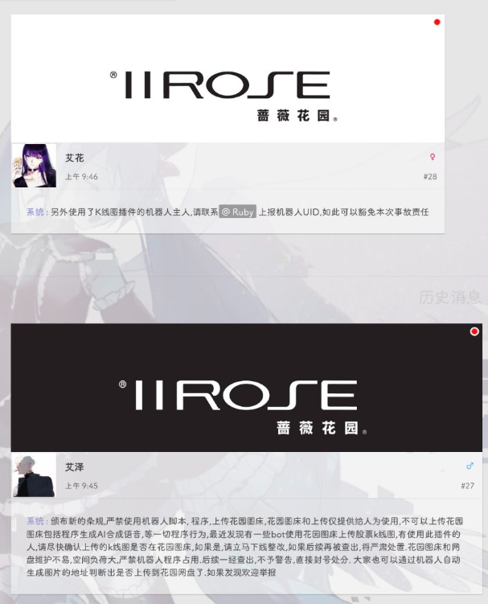
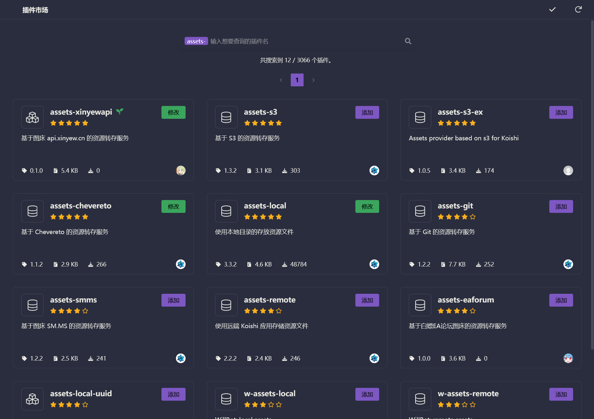
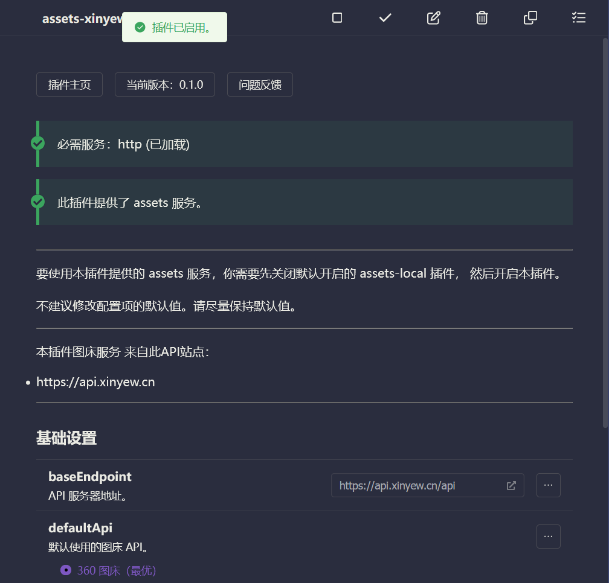

# assets 服务配置
**本页内容将说明如何配置`assets`服务。**

## 重要
:::danger
机器人以及各类脚本 需要将富媒体内容上传到第三方图床 以减少蔷薇的服务器的访问压力。

:::



## 第一步：搜索安装 `assets-`

打开插件市场搜索
```code
assets-
```



:::warning
不同的`assets`实现插件 提供的服务相同（提供图床实现、文件床实现），<br>

根据你的需求，安装任意的一个插件即可
:::

## 第二步：进行插件配置

### 2.1 配置 `assets-*` 插件

每个 `assets-*` 插件可能有不同的配置要求，

比如可能是开箱即用的，也可能要求登录某平台账号的，也可能要求填入key、token等。

请根据对应 `assets-*` 插件的项目说明、文档来进行配置。

---


### 2.2 开启 `assets-*` 插件

:::warning
注意，开启插件之前，需要先关闭默认开启的 `assets-local` 插件。
:::

配置成功后，开启插件，即可提供 `assets` 服务

> 为了方便，这里我们使用 `koishi-plugin-assets-filebin-net` 作为演示。

安装 `koishi-plugin-assets-filebin-net` 插件，然后配置此插件。

在 `seed` 配置项里填入任意不容易重复的种子字符串，然后开启插件即可！



## 🎉 完成！

至此，你已经成功为适配器接入了图床服务！

现在你的适配器可以支持图片等富媒体的发送了！
