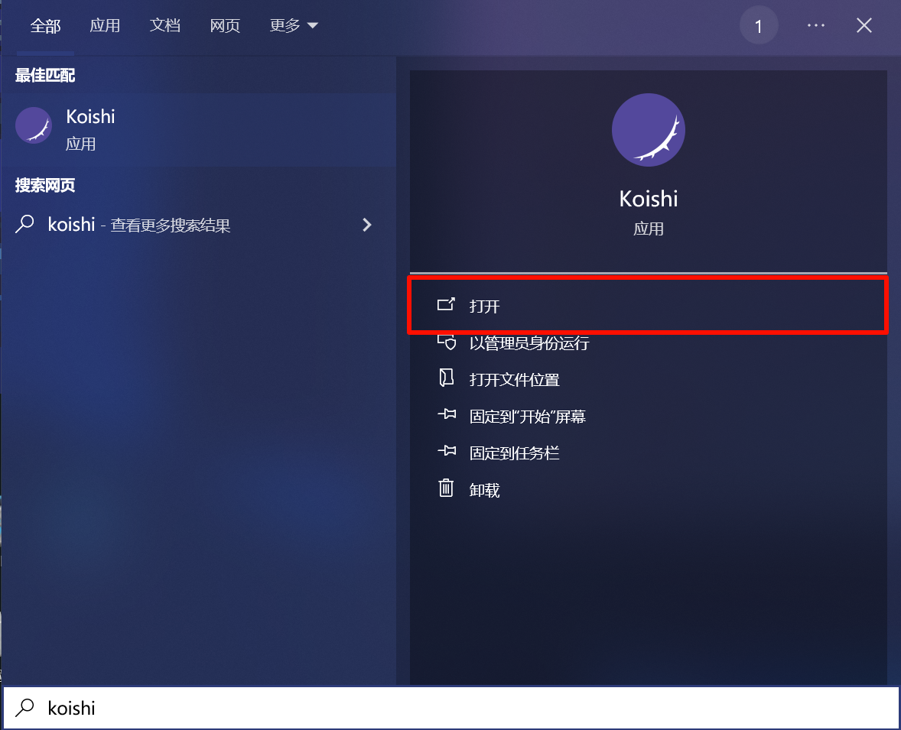
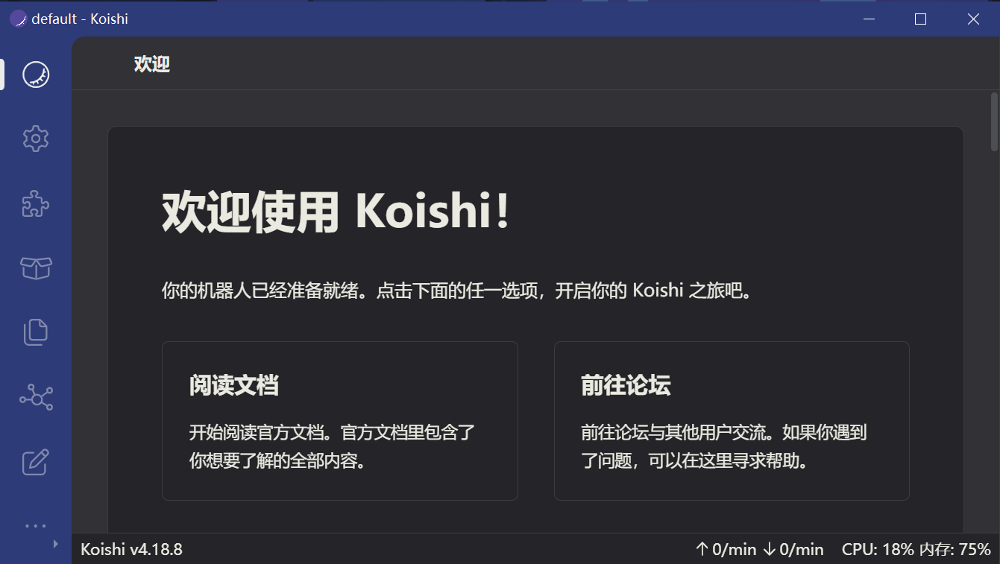
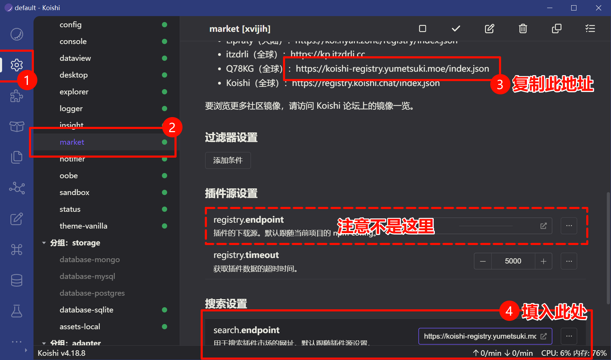
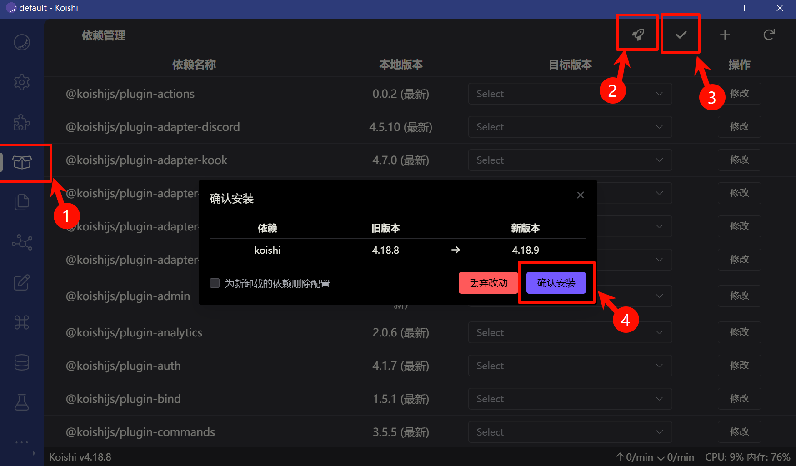
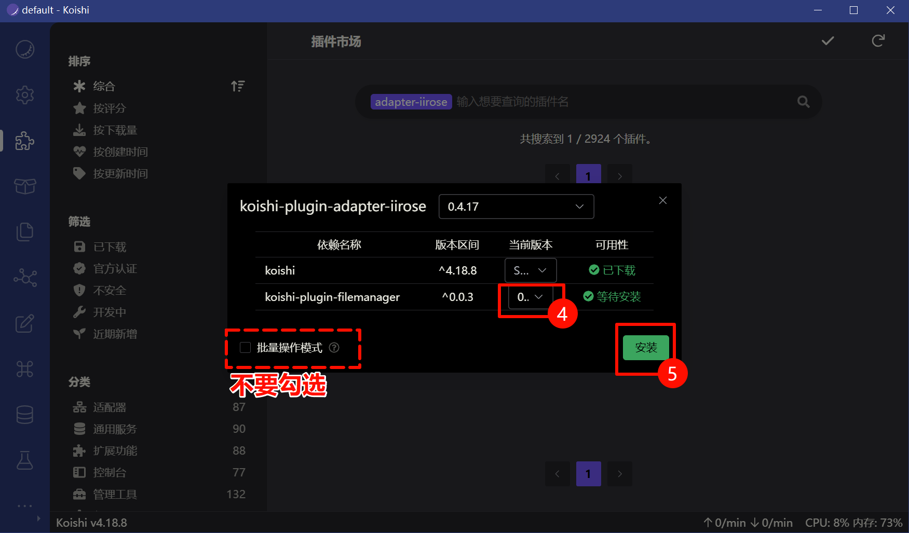
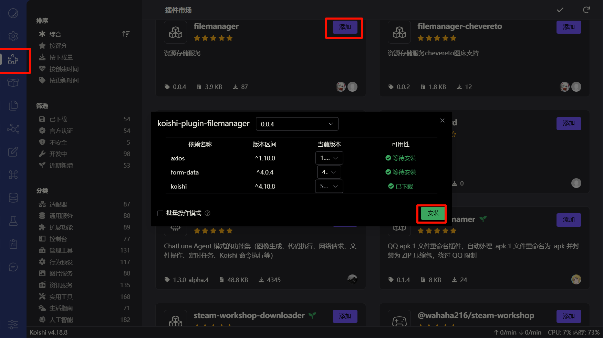
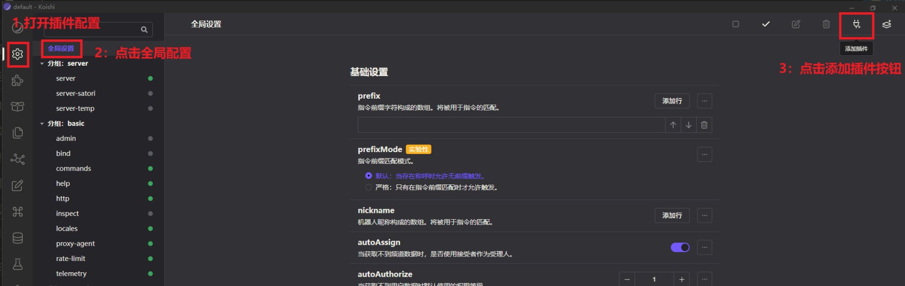
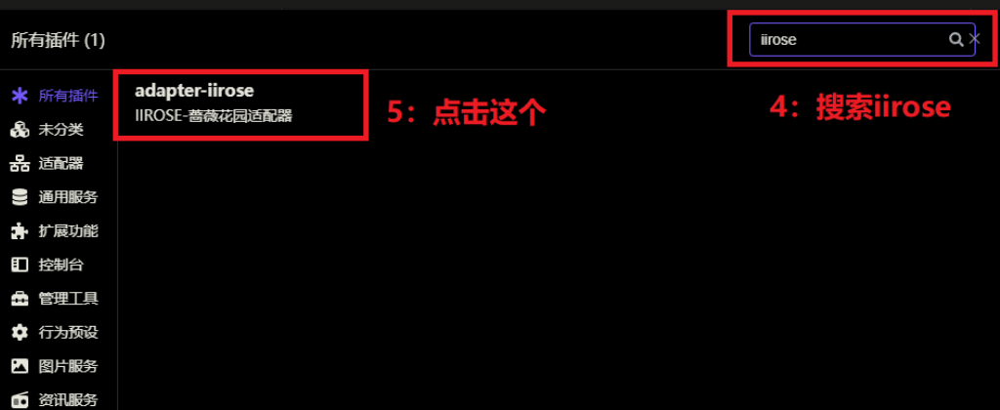
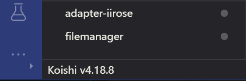

# 如何开始使用 IIROSE 适配器

:::warning 系统要求
本教程以 Windows 系统为例演示完整流程

**最低系统要求：** Windows Server 2012 或更高版本
:::

## 机器人认证须知

:::tip 重要提醒
**机器人账号必须进行认证！**

1. **认证方式：** 与站长私聊发送："我希望将`@你的用户名`设置为我的机器人账号"
2. **认证标识：** 当你的机器人账号出现"人工智能"头衔时，表示认证成功
3. **风险警告：** 未认证的机器人账号会被认定为脚本发言，**可能导致封号**

**注意事项：**
- 机器人账号无法通过发言获得花钞奖励
- 机器人发言不会计入房间热度
:::

## 第一步：安装 Koishi 框架

1. 访问 Koishi 官方安装指南：https://koishi.chat/zh-CN/manual/starter/windows.html
2. 下载并安装 Koishi

:::tip 遇到问题？
如果在安装过程中遇到任何问题，

请前往 **Koishi 官方交流群** 寻求帮助 ->

https://koishi.chat/zh-CN/about/contact.html
:::

## 第二步：启动 Koishi

1. 在 Windows 开始菜单中找到并打开 Koishi

2. 启动后会看到 Koishi 控制台界面

## 第三步：配置插件市场源

由于官方插件市场源可能存在访问问题，需要更新插件市场配置：

:::warning 重要
完成此步骤后需要**重启 Koishi**，以强制刷新插件市场
:::

## 第四步：更新所有插件

在插件管理页面，点击"全部更新"按钮：

## 第五步：安装必需插件

### 5.1 安装 IIROSE 适配器

在插件市场搜索并安装 `adapter-iirose`：

### 5.2 安装文件管理器插件

搜索并安装 `koishi-plugin-filemanager`（必需依赖）：

## 第六步：添加插件到配置

### 6.1 添加 adapter-iirose

### 6.2 添加 filemanager

确保两个插件都已添加到配置中：

