## 第七步：注册 IIROSE 账号

### 7.1 访问官网注册

1. 前往 https://iirose.com/ 完成账号注册流程

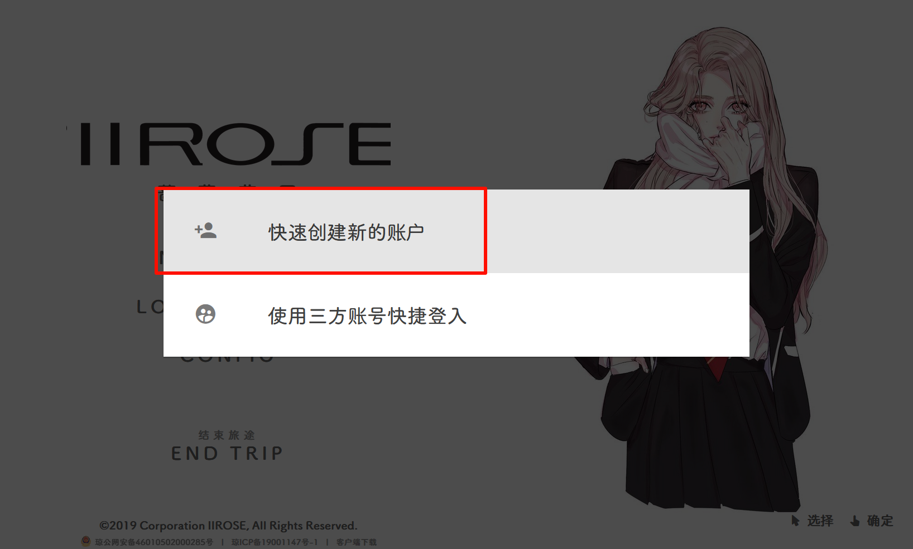

2. 注册完成后，会自动进入聊天室

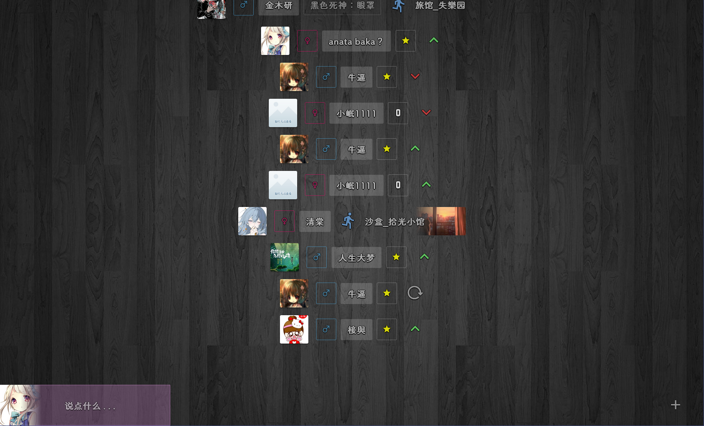

### 7.2 完善账号信息

1. 将鼠标移至屏幕最左侧 或 从左向右滑动，呼出导航菜单
2. 完成账号注册流程

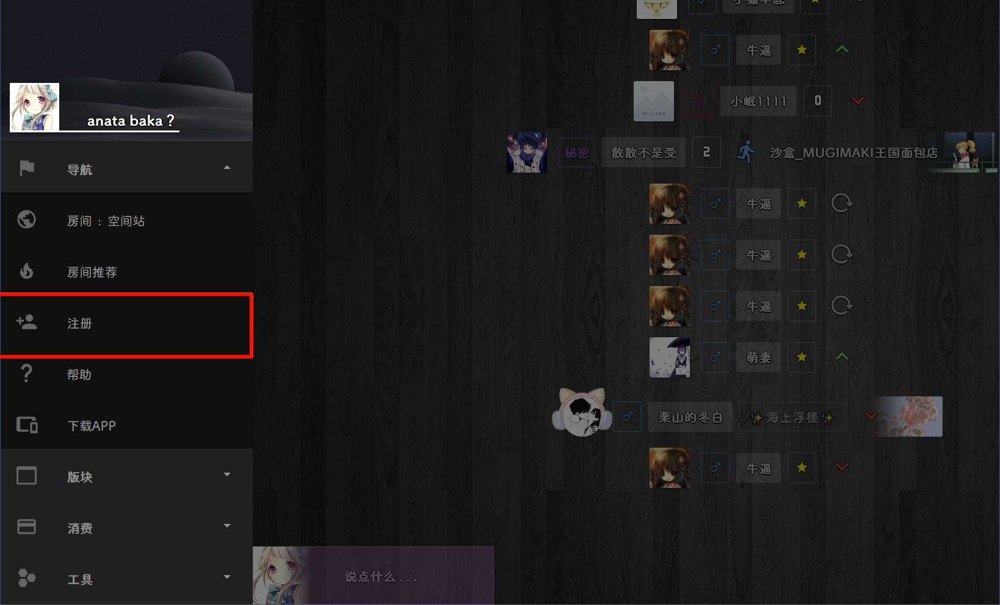

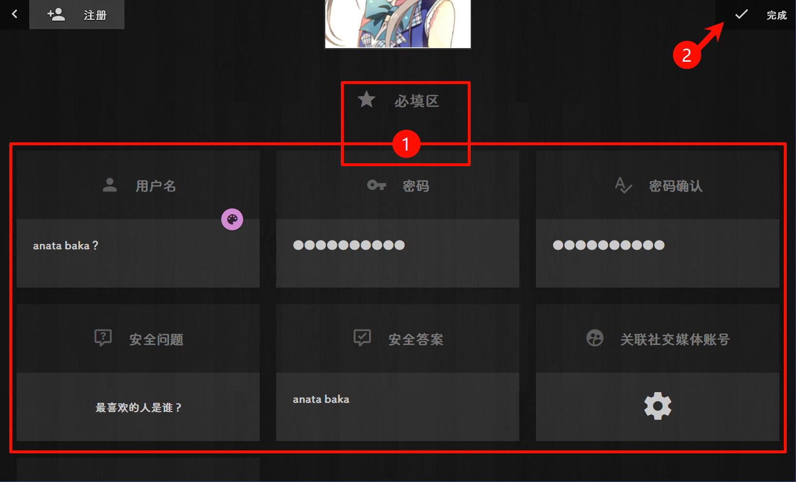

## 第八步：获取配置信息

### 8.1 获取用户名

注册完成后，返回房间列表，调出菜单栏查看账号数据：

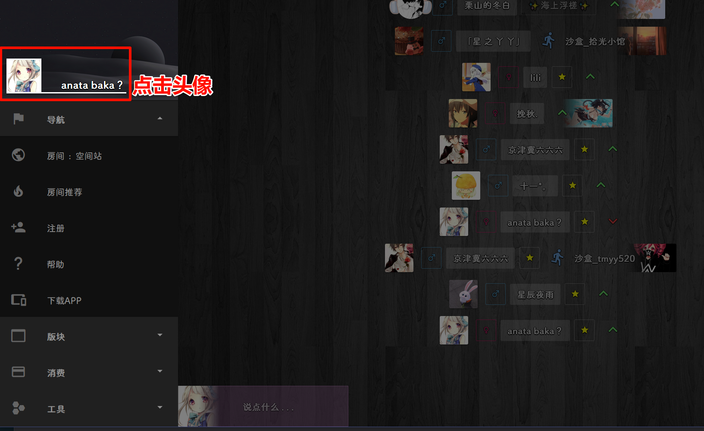

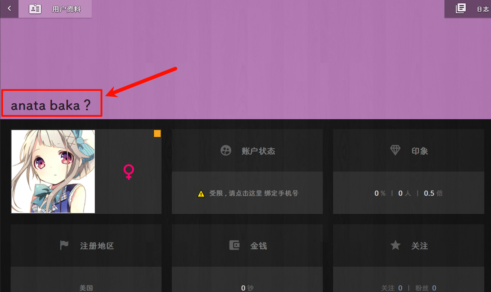

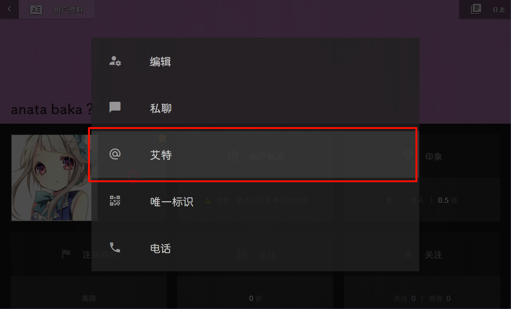

> 不带`[**]`的部分

### 8.2 获取唯一标识

找到并记录你的唯一标识（UID）：

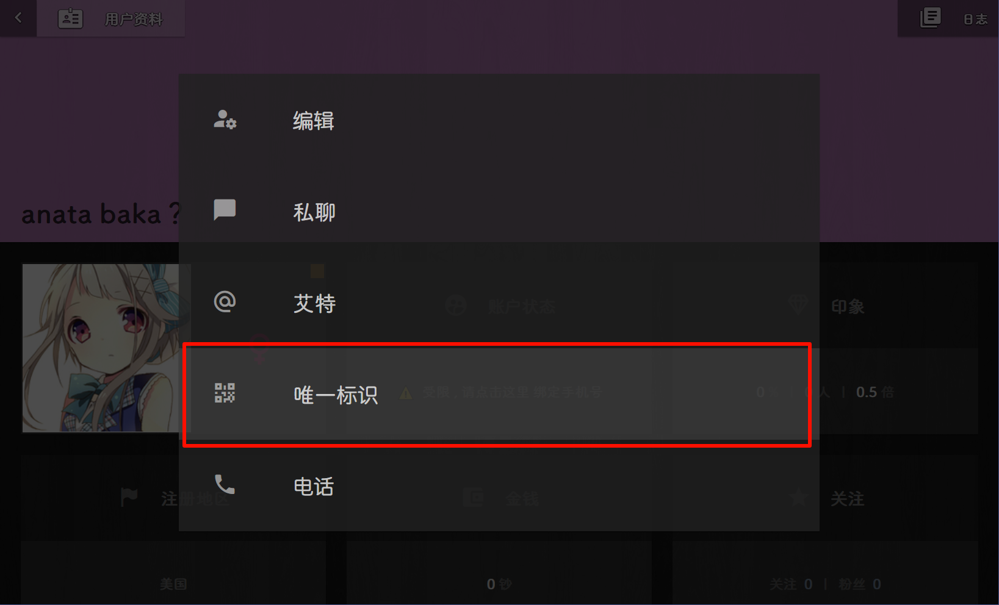

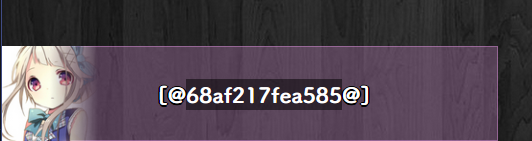

> 不带`[@@]`的部分

### 8.3 设置密码

在配置中填写你账号的密码：

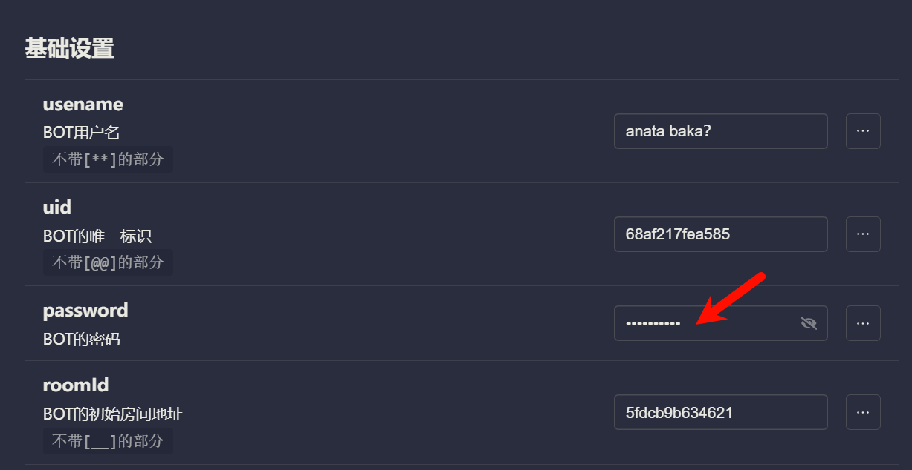

### 8.4 获取房间地址

找到你想要机器人加入的房间地址：

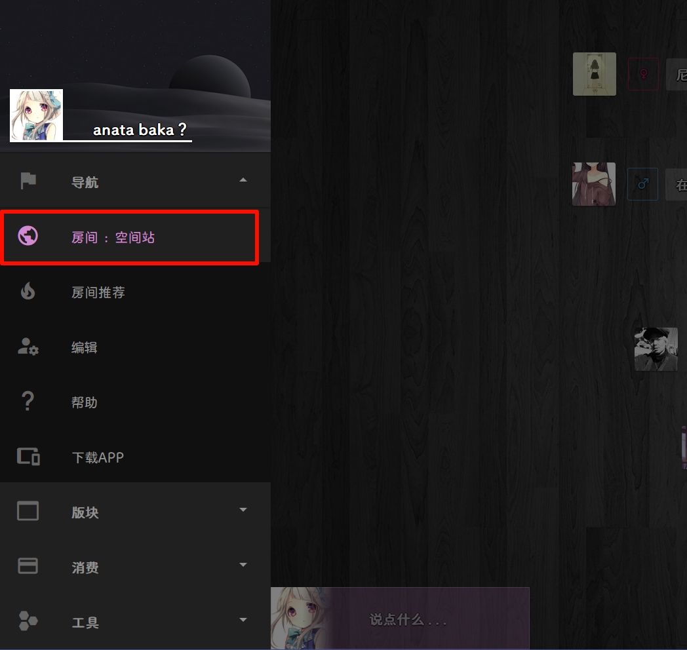

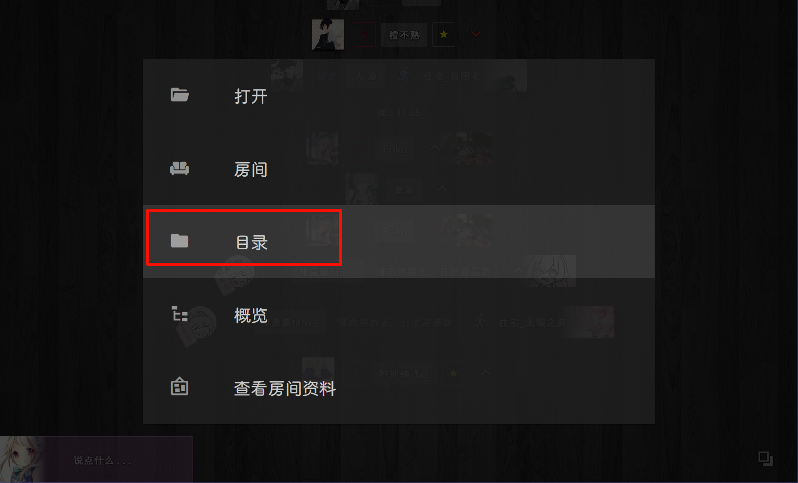

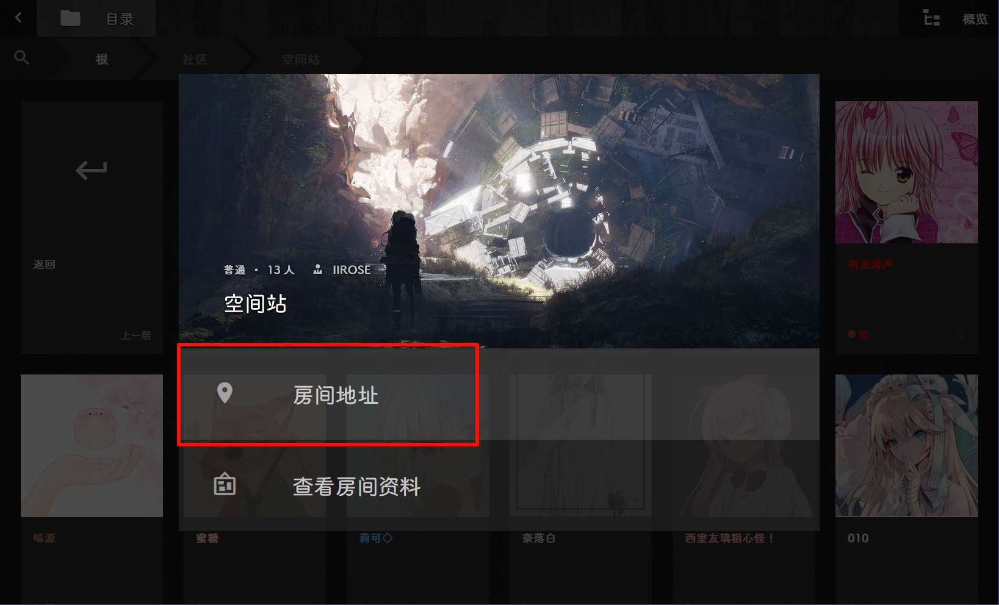

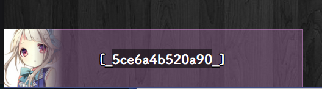
> 不带`[__]`的部分
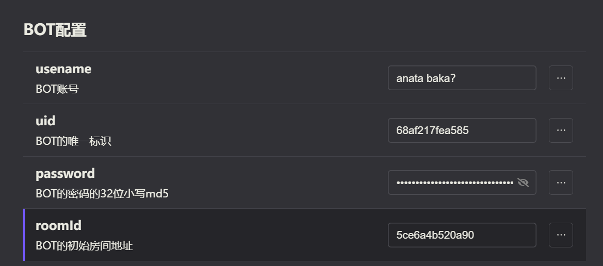

## 第九步：启动插件

### 9.1 启动 filemanager

首先启动文件管理器插件：

### 9.2 启动 adapter-iirose

然后启动 IIROSE 适配器：

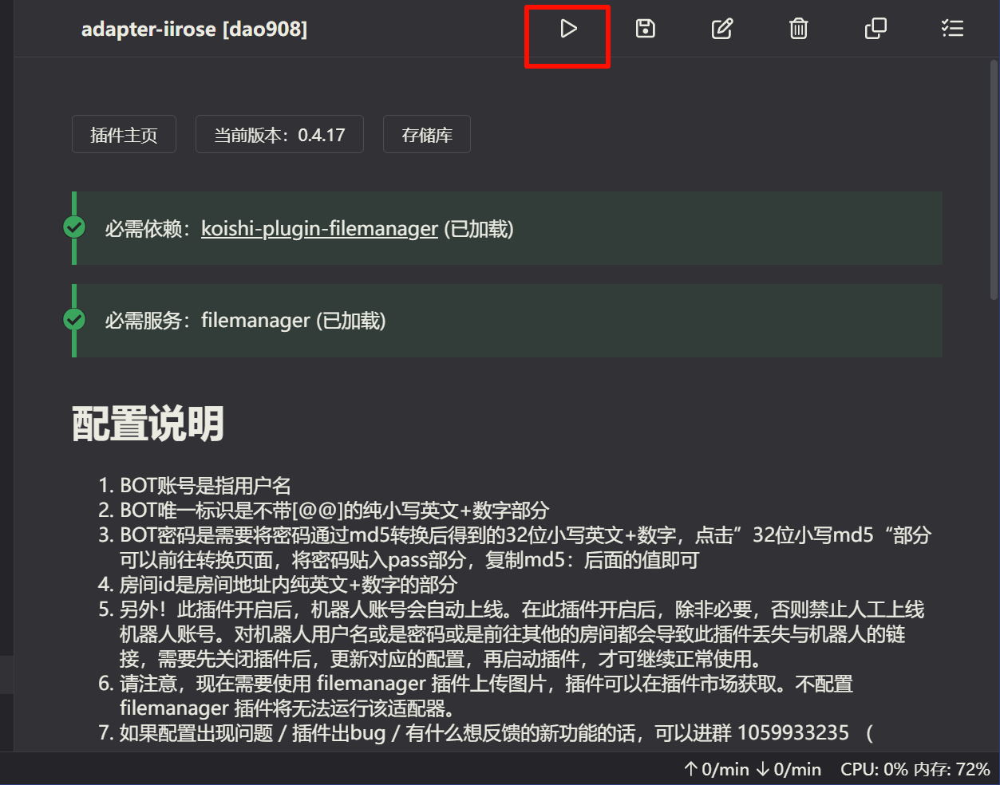

### 9.3 验证连接

启动成功后，机器人应该会出现在你指定的房间中。

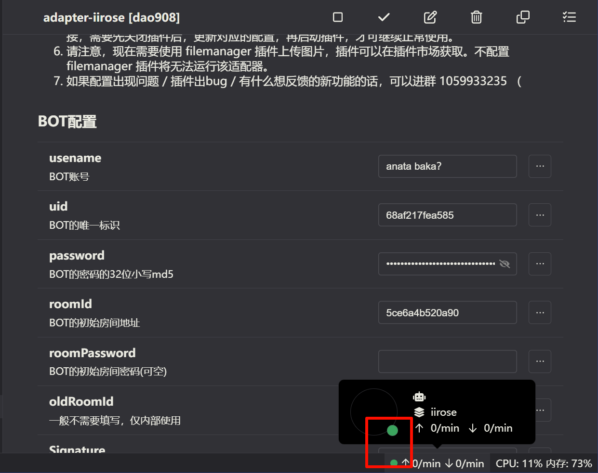

:::warning 连接失败？
如果机器人没有出现在房间中，请检查：
- 优先**查看日志**
- **账户密码**是否正确
- 网络连接是否正常
:::

## 🎉 文字回复配置完成！

:::tip
至此，你的机器人已经可以**回复文本消息**。
:::
当机器人成功出现在你的房间后，你可以：

1. **安装更多插件：** 前往插件市场安装你喜欢的功能插件
2. **配置插件：** 大部分 Koishi 插件都支持 IIROSE 平台
3. **开始使用：** 享受你的 IIROSE 机器人吧！

## 第十步：富媒体消息配置
### filemanager 图床服务

`filemanager`用于提供图床支持，

让你的机器人可以在iirose平台发送富媒体消息（图片、视频、语音）！

下一页内容 我们将说明如何配置`filemanager`插件。

