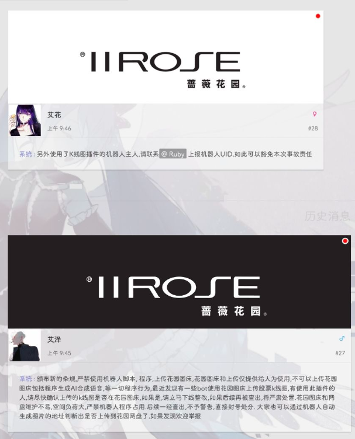
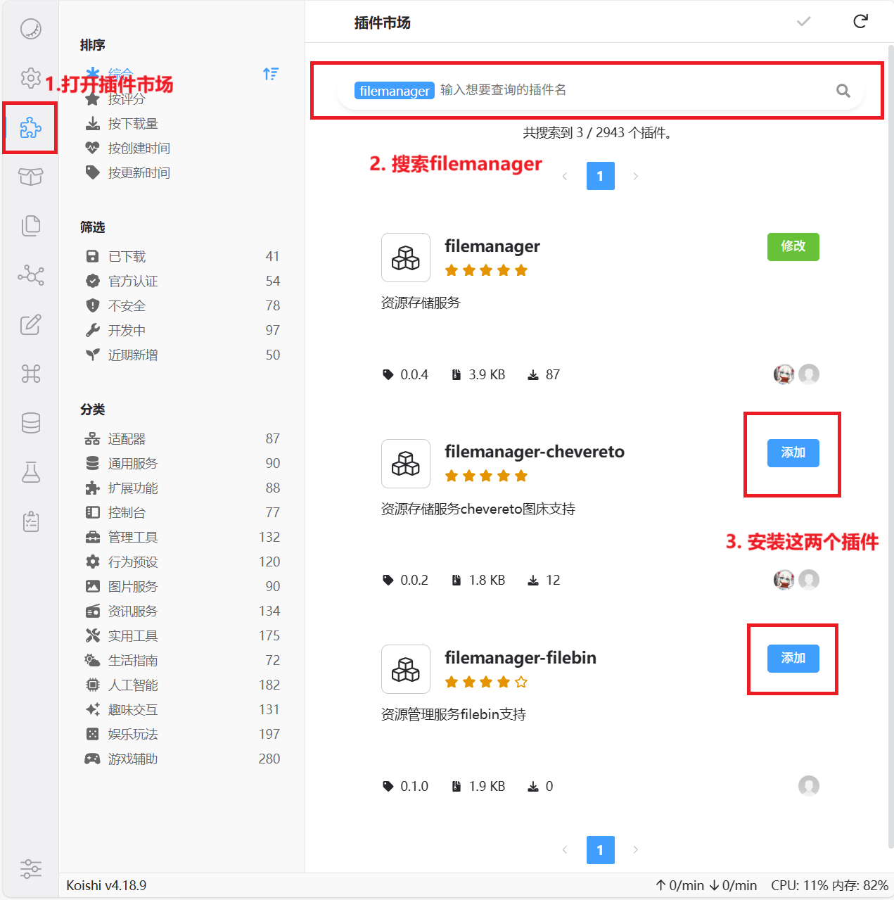
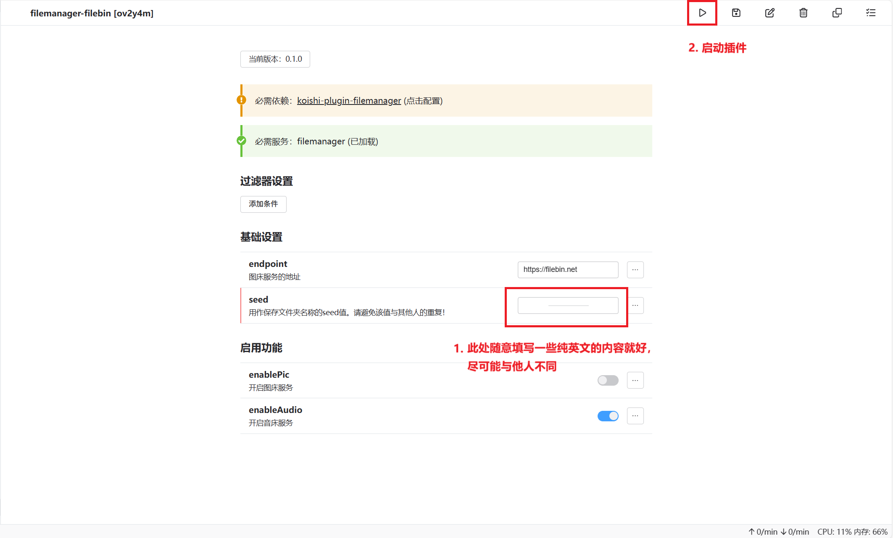
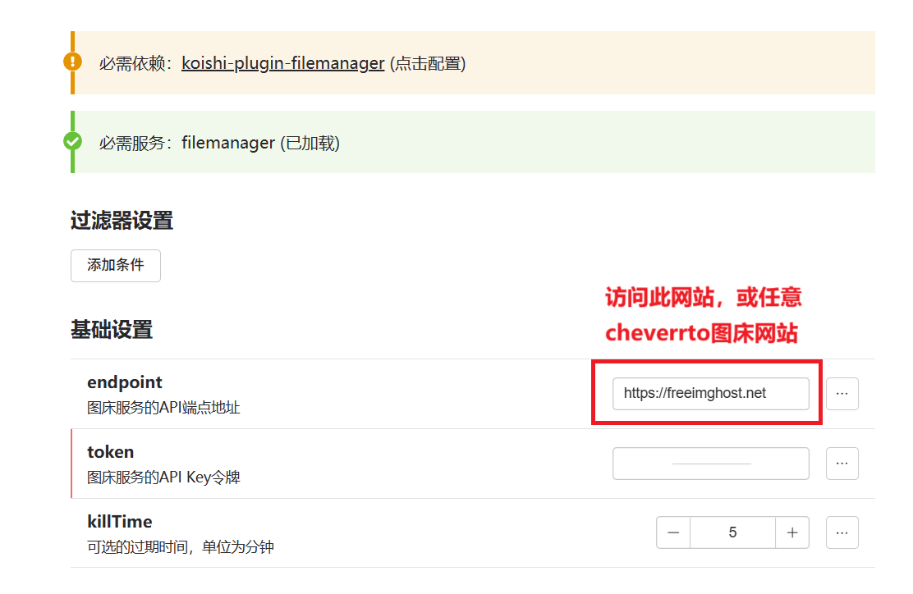
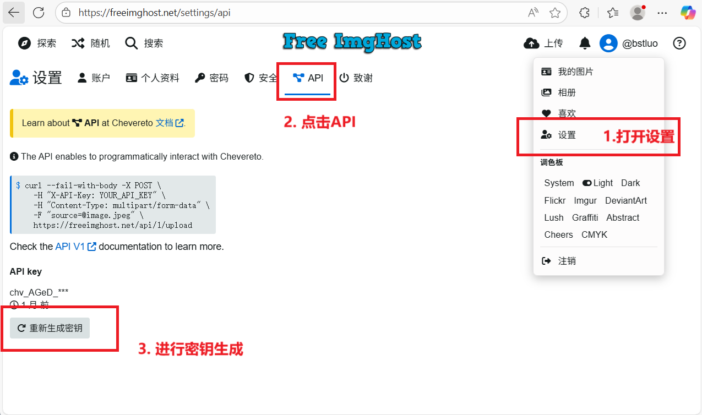
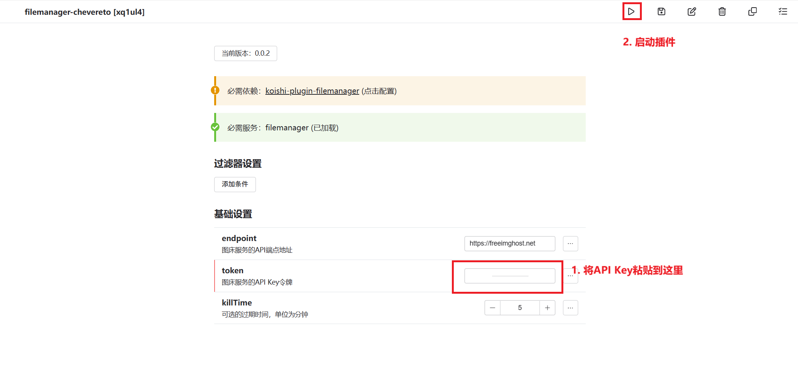

# koishi-plugin-filemanager

## 重要
:::danger
机器人以及各类脚本 需要将富媒体内容上传到第三方图床 以减少蔷薇的服务器的访问压力。

:::
**`filemanager`用于提供图床支持，本页内容将说明如何配置`filemanager`插件。**

## 第一步：安装filemanager的附属插件

:::warning
若你发现你并未安装filemanager插件，请前往[**开始使用→前置安装**](../firstime/koishi.md)页面，进行插件安装
:::

## 第二步：进行插件配置

### 2.1 filemanager-filebin插件配置

### 2.2 filemanager-chevereto插件配置

#### 2.2.1 访问chevereto站点，进行注册及登陆

> https://freeimghost.net

#### 2.2.2 获取图床API Key

#### 2.2.3 进行插件配置

## 🎉 完成！

至此，你已经成功为适配器接入了图床服务！

现在你的适配器可以支持图片，视频，以及其他文件的发送了！
